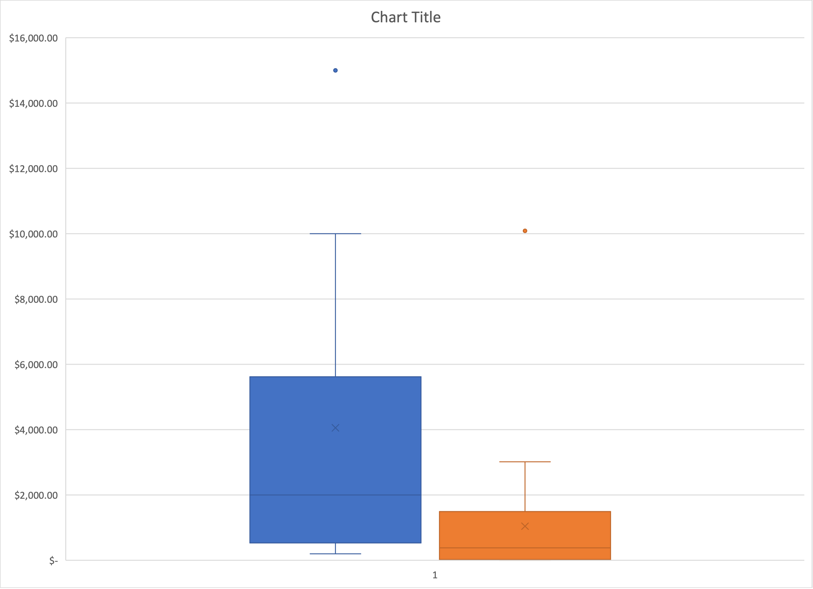
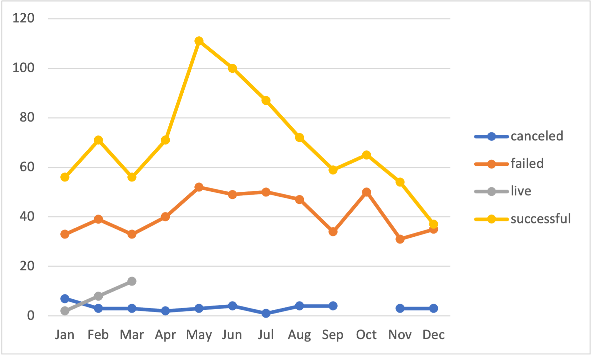

# How to add pictures to README.md

* Bullet point asterisk
* Bullet point asterisk-2

- Bullet point dash
- Bullet point dash-2

* Bullet list
  * Nested bullet
      * Sub-nested bullet etc
* Bullet list item 2

[Kickstarter Excel](KickstarterStats_Solved_copy.xlsx)

---

---

---

---

